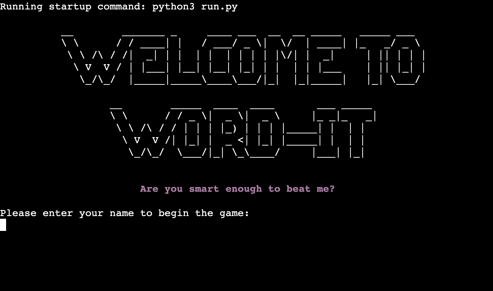

# PORTFOLIO PROJECT - 3 PYTHON #

# Word-It
## Project Purpose 
Word-It is a five letter word guessing game that is based on the popular daily online game "Wordle". I chose to base my project off this because I became addicted to Wordle during the pandemic, and have a passion for word games. The rules are simple, the user aims to guess a random 5 letter word within six attempts. They will be given colour coded indicators as they play, highlighting whether a letter is correct, incorrect, or correct but just in the wrong position. After six attempts, if the user has not guessed the answer, the game will end and the word will be revealed to the user. If the user guesses the word within their six attempts, they will get a "YOU WIN" message and can play again, or quit. 

The game is a process of elimination, combined with a little luck and logical thinking. It's a great way to test a user's problem solving ability and a quick game to do during a coffee break in work! Don't get too competitive now...

* [Here is a link to my Github Repo for PP3 Word-It](https://lynnemcgrail.github.io/ - FINISH LINK HERE)
* [Here is a link to my Heroku App - Word-It](https://word-it.herokuapp.com/)

## Final Design 

## Initial Idea Concept
My idea for this Python project was to replicate the Wordle game, because it is well-known, and if a user has never played it before it is simple to play which is why I included the option for the user to read the game instructions on starting the game. My game Word-It has replay ability as the site allows users to play again with a random generator imported into my code so that a different word is retrieved from the database contained in the words.txt file, this allows users to challenge themselves. This game functionality and word database is suitable for all ages and skill levels. I chose to use coloured text in my code so that it appealed to users and was clearly indicating their progress, this is further explained below in the 'Colour' section. [insert link to Colorama]

#### The features I wanted to include:
* Interactive game play elements to enhance user experience, the user is asked to enter their username (and validated it is letters and not left blank) and then the AI returns a welcome message and retrieves their name from the data they input.
* Instructions which appear in an ASCII art border like a scroll, again a typical 'game' feature that people would be familiar with from games as kids such as on consoles like nintendo switch etc. or online games.
* The total number of guesses is printed on starting the game
* And as the user guesses, the remaining number of guesses is printed on each input request to the user so that the user can see how many more chances they have to guess the word. 
* Colour indicators that let the user know if any of the letters they entered are correct, green indicates a correct letter and the right position, a yellow letter indicates a correct lettter, but in the wrong position and letters that are not in the word are incorrect and these are printed in red. 
* I wanted to create an app that was easily accessible and user friendly, with options for the user to play again or simply quit on finishing their first game. 
* For Word-It to look fun and interactive I not only used colours, but used ASCII borders and text to enhance the users experience and enjoyment. This can be seen on the initial start screen 'Welcome to Word-It' and throughout the gameplay when the user wins; 'You Win', and if the user decides to quit the game 'Goodbye' is printed in ASCII art words.

#
## Table of Contents
- [UX/UI](#uxui)
    * [SITE GOALS](#site-goals)
    * [USERSTORIES](#user-stories)
    * [REQUIREMENTS](#requirements)
    * [EXPECTATIONS](#expectations)
- [LOGICFLOW](#logicflow)
  * [FEATURES](#features)
  * [DESIGN](#design)
- [LANGUAGES USED](#languages-used)
  * [PROGRAMMES USED](#programmes-used)
- [TESTING](#testing)
  * [VALIDATION AND ACCESSIBILITY](#validation-and-accessibility)
  * [LIGHTHOUSE](#lighthouse)
  * [ACCESSIBILITY](#accessibility)
  * [CSS](#css)
  * [HTML](#html)
  * [FUNCTIONALITY](#functionality)
- [BUGS AND ERRORS](#bugs-and-errors)
  * [SOLVED BUGS AND ERRORS](#solved-bugs-and-errors)
  * [UNSOLVED BUGS AND ERRORS](#unsolved-bugs-and-errors)
- [DEPLOYMENT](#deployment)
  * [REMOTE](#remote-deployment)
  * [HOW TO FORK A REPOSITORY](#how-to-fork-a-repository)
  * [HOW TO CLONE A REPOSITORY](#how-to-clone-a-repository)
  * [HOW TO MAKE A LOCAL CLONE](#how-to-make-a-local-clone)
- [CREDITS](#credits-and-references)
  * [IMAGES AND INFORMATION](#images-and-information-sources)
  * [CODE](#code-sources)
- [ACKNOWLEDGEMENTS](#acknowledgements)

# UX/UI
This Word-It game was created to show my programming knowledge of Python so far with Code Institute.
## Site Goals
* To showcase my software development skills in Python.
* To create a user experience that was intellectually challenging, engaging and rewarding.
* To create an app that functions well, returns feedback to the user and is easily accessible to all. 
* To entice the user to play the game again.

## First Time Visitor and Returning Visitor Goals
* I want it to be easy for the user to play the game.
* I want the user to be able to easily navigate throughout the instructions and understand the gameplay.
* I want the user to be enticed to play the game again.
* I want the game to select a different word each time the user plays, and will achieve this by using the Python library [random](https://docs.python.org/3/library/random.html?highlight=random#module-random) - `random.choice`, which will select a random word from the words.txt file.

#
## User Stories  
The **user** is any person who enjoys word games and likes to test their problem solving skills.

| ID | ROLE | ACTION | GOAL |
|-----------------|:-------------|:---------------:|:---------------:|
| 1 | USER | As a user, I want to guess the word in 6 guesses or less | So I can win Word-It and challenge myself|
| 2 | USER | As a user, I want to navigate the game play easily | So it enhances my user experience|
| 3 | USER | As a user, I want to be able to start the game when I am ready | So I can prepare myself |
| 4 | USER | As a user, I want the choice to load the game instructions if I need them | So I can decide if I need them or not |
| 5 | USER | As a user, I want to see how many letters are correct / incorrect as I play | So I can see how close I am to winning |
| 6 | USER | As a user, I want to be able to play again when the game ends with a new word | So I can challenge myself|
| 7 | USER | As a user, When the game ends, I want the option to quit or play again | So I can choose to leave if I want to|

#
## Requirements 
- Easy to navigate and understand the game play, which is enabled via the instructions menu option
- Keep the user engaged through user experience; the use of Pyfiglet word art, username input and welcome message which addresses the user, guess validation, guess colour coded letter feedback, user's remaining guesses counter throughout the gameplay, game over win / lose, the correct word displayed if the user loses, and giving the user the option to play again or quit - on quitting the game displays a goodbye message.

#
## Expectations 
- The user will be prompted to enter their username to start the game and the AI will welcome the user and import the data they input as their username.
- The user will have the choice to either initiate game play or read the instructions, this is an option as a returning user will be familiar with how to play and may not want to read the instructions every time.
- I expect that after each guess, the app will provide feedback to the user and let them know which letters are correct (green), correct but in the wrong letter space (yellow) or incorrect and not in the word (red), and should the user not guess the word within the 6 guesses, the game will return the word they were trying to guess.
- Game over - I expect the user to be able to choose to play again, or quit the game, on which if they choose to quit, a "Goodbye" message will be displayed to the user. If they choose to play again, the game will clear and start from the beginning.

## Logic Flow 
### Lucid Chart 
* I used [Lucid Chart](https://www.lucidchart.com/pages/) to create a flow chart in order to visualise the game play, and how each of the stages in the game would execute and from this, I was able to make a plan for the functions that would be required in Python.

## Game Features
### Welcome Start Screen
* On entering the site, the user is greeted with a welcome message and prompted to input their name to begin.
* The welcome message was created using Pyfiglet which takes ASCII text and renders it in [ASCII art fonts](https://www.geeksforgeeks.org/python-ascii-art-using-pyfiglet-module/) 

* The game validates the user input, by ensuring the data entered consists of numbers or letters, they cannot submit blank space. An error message will appear if the data is invalid.

### Menu 
* Once the username has input their name, the computer will greet them by name.

* They will then be asked if they would like to play the game or read the instructions by inputting "P" or "I".
* The input can be upper or lower case, the app can handle both inputs by using the function, lower()
* If the user does not input a "P", "p", "I" or an "i" they will get an error message asking them to input a valid option.

### Instructions: How to play
* If the user inputs "I" or "i", the instructions on how to play the game will be displayed.
* The instructions are simple and contained within a scroll to make it fun and a feature which makes it feel like an old gameboy style game, this was reminiscent from my childhood and created using [ASCII art](https://www.asciiart.eu/art-and-design/borders)

## Creating the Heroku app

When you create the app, you will need to add two buildpacks from the _Settings_ tab. The ordering is as follows:

1. `heroku/python`
2. `heroku/nodejs`

You must then create a _Config Var_ called `PORT`. Set this to `8000`

If you have credentials, such as in the Love Sandwiches project, you must create another _Config Var_ called `CREDS` and paste the JSON into the value field.

Connect your GitHub repository and deploy as normal.

